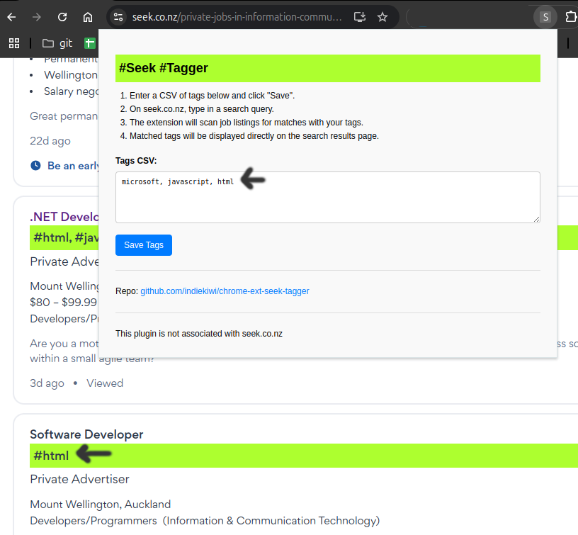

# chrome-ext-seek-tagger

A search page on Seek may display results unrelated to the search query. This chrome plugin checks for keywords on the listing page and highlights their relevance, making it easier to determine how closely each listing matches your specified keywords.

1. Clone repo.
2. Chrome > Extensions > Manage Extensions.
3. Load unpacked > navigate to the downloaded contents.
4. In the extensions, you may wish to pin this extension's icon.
5. Click the icon, add your keywords in CSV format > Save Tags.
6. On seek.co.nz, search query pages will retrieve the job listing and search for tags:

